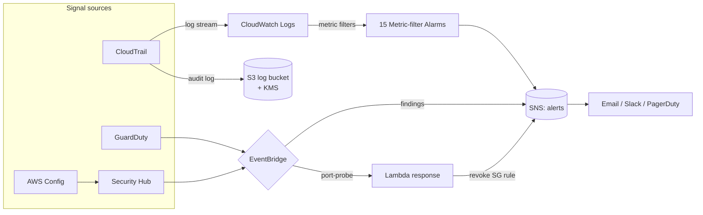

# AWS Detection Engineering Lab

A self-contained, deployable **blue-team / detection-engineering lab on AWS**,
written entirely in Terraform. It stands up the telemetry, managed threat
detection, custom detection-as-code, alerting and optional automated response
that a small SOC or a cloud security engineer would run in a real account —
then gives you a way to safely generate findings and watch the pipeline fire.

Built as a portfolio piece to demonstrate detection engineering, cloud security
architecture and infrastructure-as-code in one repo.

> Sibling labs: [`Azure-Detection-Engineering-Lab`](https://github.com/H3llKa1ser/Azure-Detection-Engineering-Lab) ·
> [`Cloud-Policy-and-Guardrails-Lab`](https://github.com/H3llKa1ser/Cloud-Policy-and-Guardrails-Lab)

---

## What it builds

| Layer | Service(s) | Purpose |
|-------|-----------|---------|
| **Telemetry** | CloudTrail (multi-region) → S3 + CloudWatch Logs, optional KMS CMK | Durable, validated audit log; near-real-time stream for detections |
| **Config & compliance** | AWS Config recorder + 10 managed rules | Continuous configuration drift / misconfiguration detection |
| **Managed detection** | GuardDuty, Security Hub (AWS FSBP + CIS 1.4) | Behavioural threat detection and standards scoring |
| **Detection-as-code** | 15 CloudWatch metric-filter alarms over CloudTrail | CIS monitoring controls, mapped to MITRE ATT&CK |
| **Alerting** | SNS topic + EventBridge rules | Single notification fabric for every signal source |
| **Response (opt-in)** | EventBridge → Lambda | SOAR-lite: auto-revoke an offending security-group rule |

Everything is modular — each concern is its own Terraform module so it can be
read, reviewed and reused independently.

## Architecture



## Detection catalogue

Each detection is a CloudWatch Logs metric filter + alarm defined as code in
[`modules/detections/catalogue.tf`](modules/detections/catalogue.tf). Add a map
entry to add a detection — nothing else to touch. All map to the CIS AWS
Foundations Benchmark monitoring controls and are annotated with MITRE ATT&CK.

| Detection | CIS | MITRE ATT&CK |
|-----------|-----|--------------|
| Unauthorized / access-denied API calls | 3.1 | T1078 Valid Accounts |
| Console sign-in without MFA | 3.2 | T1078 Valid Accounts |
| Root account usage | 3.3 | T1078.004 Cloud Accounts |
| IAM policy changes | 3.4 | T1098 Account Manipulation |
| CloudTrail config changes | 3.5 | T1562.008 Disable Cloud Logs |
| Failed console authentication | 3.6 | T1110 Brute Force |
| KMS CMK disable / delete | 3.7 | T1486 Data Encrypted for Impact |
| S3 bucket policy / ACL changes | 3.8 | T1530 Data from Cloud Storage |
| AWS Config service changes | 3.9 | T1562.008 Disable Cloud Logs |
| Security group changes | 3.10 | T1562.007 Modify Cloud Firewall |
| Network ACL changes | 3.11 | T1562.007 Modify Cloud Firewall |
| Network gateway changes | 3.12 | T1562.007 Modify Cloud Firewall |
| Route table changes | 3.13 | T1562.007 Modify Cloud Firewall |
| VPC changes | 3.14 | T1562.007 Modify Cloud Firewall |
| AWS Organizations changes | 3.15 | T1098 Account Manipulation |

## Prerequisites

- Terraform >= 1.5
- AWS CLI v2, authenticated to a **non-production / sandbox account** you can afford to deploy managed services in
- Permissions to create IAM, CloudTrail, Config, GuardDuty, Security Hub, SNS, EventBridge, Lambda, KMS and S3 resources

## Deploy

```bash
git clone https://github.com/H3llKa1ser/AWS-Detection-Engineering-Lab.git
cd AWS-Detection-Engineering-Lab

cp terraform.tfvars.example terraform.tfvars
# edit terraform.tfvars: set aws_region and alert_email

terraform init
terraform plan
terraform apply
```

Then confirm the SNS subscription email AWS sends you, or wire the topic to
Slack / PagerDuty / your SIEM.

## Validate it works

See [`docs/validation.md`](docs/validation.md) for the full walkthrough. The
fast path:

```bash
# 1. Make GuardDuty emit sample findings of every type
./scripts/generate-findings.sh

# 2. Trip a CloudTrail metric-filter detection on purpose (safe, reversible)
aws ec2 create-security-group --group-name detlab-test --description test
# -> fires the "security group changes" alarm within ~5 minutes
```

For adversary emulation that produces *real* (not sample) findings, point
[Stratus Red Team](https://github.com/DataDog/stratus-red-team) at the account —
e.g. `stratus detonate aws.credential-access.ec2-get-password-data`.

## Cost

The lab is designed to be cheap but **is not free**. Rough monthly order of
magnitude in an idle sandbox: CloudTrail management events (free for the first
copy), GuardDuty and Security Hub bill on events/findings analysed, Config bills
per configuration item recorded and per rule evaluation. Expect **single-digit
to low-tens of USD/month** idle; more if you generate heavy activity. Destroy
when you are done.

## Clean up

```bash
terraform destroy
```

`force_destroy = true` is set on the log buckets for lab convenience, so destroy
removes them even with objects inside. (Remove that in any real deployment.)

## Repo layout

```
.
├── main.tf / variables.tf / outputs.tf / providers.tf   # root composition
├── terraform.tfvars.example
├── modules/
│   ├── logging/           # CloudTrail -> S3 + CWL, KMS
│   ├── config/            # AWS Config recorder + managed rules
│   ├── threat-detection/  # GuardDuty + Security Hub
│   ├── detections/        # detection-as-code catalogue (metric filters)
│   ├── alerting/          # SNS + EventBridge routing
│   └── response/          # opt-in Lambda auto-response
├── docs/                  # architecture, runbook, validation
└── scripts/               # finding generators
```

## Roadmap

- [ ] VPC Flow Logs + DNS query logging modules feeding GuardDuty
- [ ] Athena + Glue table over the CloudTrail S3 bucket for threat-hunting queries
- [ ] Sigma-rule → CloudWatch Logs Insights conversion for a second detection path
- [ ] Multi-account delegated-admin pattern (GuardDuty/Security Hub organisation)
- [ ] Terratest coverage in CI (GitHub Actions)

## Notes & disclaimer

This is a learning / demonstration lab. The Terraform is `terraform validate`-clean
but you are responsible for the cost and blast radius in your own account. Deploy
only in an account you own and can safely tear down.

## License

MIT — see [LICENSE](LICENSE).
