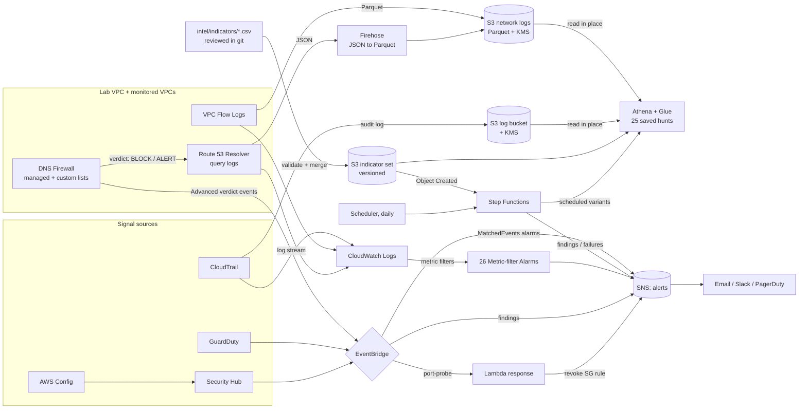

# AWS Detection Engineering Lab

A self-contained, deployable **blue-team / detection-engineering lab on AWS**,
written entirely in Terraform. It stands up the telemetry, managed threat
detection, custom detection-as-code, alerting and optional automated response
that a small SOC or a cloud security engineer would run in a real account —
then gives you a way to safely generate findings and watch the pipeline fire.

Built as a portfolio piece to demonstrate detection engineering, cloud security
architecture and infrastructure-as-code in one repo.

> Sibling labs: [`Azure-Detection-Engineering-Lab`](https://github.com/H3llKa1ser/Azure-Detection-Engineering-Lab) ·
> [`Cloud-Policy-and-Guardrails-Lab`](https://github.com/H3llKa1ser/Cloud-Policy-and-Guardrails-Lab)

---

## What it builds

| Layer | Service(s) | Purpose |
|-------|-----------|---------|
| **Telemetry** | CloudTrail (multi-region) → S3 + CloudWatch Logs, optional KMS CMK | Durable, validated audit log; near-real-time stream for detections |
| **Config & compliance** | AWS Config recorder + 10 managed rules | Continuous configuration drift / misconfiguration detection |
| **Managed detection** | GuardDuty, Security Hub (AWS FSBP + CIS 1.4) | Behavioural threat detection and standards scoring |
| **Network telemetry** | VPC Flow Logs (custom v5 format) + Route 53 Resolver query logs → CloudWatch Logs, isolated lab VPC | Network and DNS visibility you own and can write detections against |
| **DNS Firewall** | Route 53 Resolver DNS Firewall: AWS-managed threat lists, custom block/allow lists, and DNS Firewall Advanced (DGA, dictionary DGA, tunnelling) | Prevention: known-bad domains *and* never-seen-before DGA/tunnelling traffic get no answer; every verdict is logged |
| **Detection-as-code** | 26 metric-filter alarms over CloudTrail, flow and DNS logs, plus 3 EventBridge-driven alarms for DNS Firewall Advanced | CIS monitoring controls + network/DNS/DNS Firewall detections, mapped to MITRE ATT&CK |
| **Network log lake** | VPC Flow Logs (native Parquet) and Resolver query logs (Firehose → Parquet) in S3, with Athena tables | Months of network and DNS history, cheap to keep and to scan, joinable with CloudTrail |
| **Threat intelligence** | Curated IP/CIDR/domain indicators in git (`intel/`), validated, merged to a versioned S3 object and Athena table | Known-bad infrastructure matched against flows, DNS and CloudTrail, with automatic retro-hunts when indicators change |
| **Threat hunting** | Glue tables over CloudTrail, flow, DNS logs and indicators (partition projection), Athena workgroup, 25 saved hunts, hunter IAM policy | Retrospective search for what real-time rules can't express: baselines, sequences, cross-source joins |
| **Scheduled hunts** | EventBridge Scheduler → Step Functions → Athena → SNS, plus a dead man's switch Recommended hunts for what is deployed (10-16) run daily over the last 24h; alerts only on findings or failures, each finding once |
| **Alerting** | SNS topic + EventBridge rules | Single notification fabric for every signal source |
| **Response (opt-in)** | EventBridge → Lambda | SOAR-lite: auto-revoke an offending security-group rule |
| **Traffic generator (opt-in)** | Hardened t3.micro in the lab VPC | Produces DNS telemetry so the DNS detections (and a real GuardDuty finding) fire |

Everything is modular — each concern is its own Terraform module so it can be
read, reviewed and reused independently.

## Architecture



## Detection catalogue

Each detection is a CloudWatch Logs metric filter + alarm defined as code in
[`catalogue.tf`](modules/detections/catalogue.tf) (CloudTrail) and
[`catalogue_network.tf`](modules/detections/catalogue_network.tf) (flow + DNS).
Add a map entry to add a detection — nothing else to touch. Flow-log entries
declare only the fields they care about; the 22-field space-delimited pattern is
generated for you. Detections for a telemetry source that is switched off are
skipped automatically.

### CloudTrail (CIS AWS Foundations Benchmark v1.4.0, section 4: Monitoring)

| Detection | CIS | MITRE ATT&CK |
|-----------|-----|--------------|
| Unauthorized / access-denied API calls | 4.1 | T1078 Valid Accounts |
| Console sign-in without MFA | 4.2 | T1078 Valid Accounts |
| Root account usage | 4.3 | T1078.004 Cloud Accounts |
| IAM policy changes | 4.4 | T1098 Account Manipulation |
| CloudTrail config changes | 4.5 | T1562.008 Disable Cloud Logs |
| Failed console authentication | 4.6 | T1110 Brute Force |
| KMS CMK disable / delete | 4.7 | T1486 Data Encrypted for Impact |
| S3 bucket policy / ACL changes | 4.8 | T1530 Data from Cloud Storage |
| AWS Config service changes | 4.9 | T1562.008 Disable Cloud Logs |
| Security group changes | 4.10 | T1562.007 Modify Cloud Firewall |
| Network ACL changes | 4.11 | T1562.007 Modify Cloud Firewall |
| Network gateway changes | 4.12 | T1562.007 Modify Cloud Firewall |
| Route table changes | 4.13 | T1562.007 Modify Cloud Firewall |
| VPC changes | 4.14 | T1562.007 Modify Cloud Firewall |
| AWS Organizations changes | 4.15 | T1098 Account Manipulation |

### Network and DNS

| Detection | Source | Fires at (per 5 min) | MITRE ATT&CK |
|-----------|--------|----------------------|--------------|
| Rejected inbound SSH burst | Flow | 20 | T1110 Brute Force / T1046 |
| Rejected inbound RDP burst | Flow | 20 | T1110 Brute Force / T1046 |
| Rejected-flow spike (scan) | Flow | 500 | T1046 Network Service Discovery |
| Accepted outbound SMB (445) | Flow | 1 | T1021.002 / T1048 |
| Single egress flow > 500 MB | Flow | 1 | T1048 / T1567 Exfiltration |
| NXDOMAIN spike | DNS | 50 | T1568.002 Domain Generation Algorithms |
| TXT query spike | DNS | 100 | T1071.004 Application Layer Protocol: DNS |
| Cryptomining pool lookup | DNS | 1 | T1496 Resource Hijacking |
| `.onion` lookup | DNS | 1 | T1090.003 Multi-hop Proxy |
| DNS Firewall blocked a query | DNS Firewall | 1 | T1071.004 / T1568 Dynamic Resolution |
| DNS Firewall ALERT rule matched | DNS Firewall | 1 | T1071.004 / T1568 Dynamic Resolution |
| DNS Firewall Advanced: DGA | EventBridge | 1 new name | T1568.002 Domain Generation Algorithms |
| DNS Firewall Advanced: dictionary DGA | EventBridge | 1 new name | T1568.002 Domain Generation Algorithms |
| DNS Firewall Advanced: DNS tunnelling | EventBridge | 1 new name | T1071.004 DNS / T1048 Exfiltration |

### How this relates to GuardDuty

GuardDuty does **not** read the flow logs or query logs this lab configures. It
analyses VPC flow and DNS data from its own independent feed, whether or not you
enable either (with one catch: its DNS analysis only covers queries that go
through the Route 53 Resolver). The network modules exist so that *you* have the
raw telemetry: transparent, tunable detections you wrote, retention you control,
and data to hunt through. The two layers overlap on purpose: the traffic
generator's mining-pool lookups should trip both `dns_mining_pool_lookup` and
GuardDuty's `CryptoCurrency:EC2/BitcoinTool.B!DNS`, which is a useful
side-by-side of custom vs managed detection. By default DNS Firewall also blocks
those mining-pool domains (see below); set `dns_firewall_block_domains = []` for
the cleanest GuardDuty comparison, since I have not verified whether GuardDuty
still raises that finding for a query DNS Firewall blocked.

## DNS Firewall: block, not just detect

Every detection above tells you something already happened. DNS Firewall stops a
class of it from working: a query for a known-bad domain gets no usable answer,
so malware cannot find its command-and-control server and a miner cannot find its
pool. One rule group, first match wins:

| Priority | Action | Domain list |
|----------|--------|-------------|
| 100 | ALLOW | Your allow list (`dns_firewall_allow_domains`): false-positive overrides |
| 200 | BLOCK | Your block list (`dns_firewall_block_domains`): defaults to public mining pools |
| 300 | BLOCK | `AWSManagedDomainsMalwareDomainList` |
| 310 | BLOCK | `AWSManagedDomainsBotnetCommandandControl` |
| 320 | BLOCK | `AWSManagedDomainsAggregateThreatList` (superset of the others; catches the rest) |
| 400 | BLOCK | **Advanced** DGA detector, MEDIUM confidence |
| 410 | BLOCK | **Advanced** dictionary-DGA detector, MEDIUM confidence |
| 420 | BLOCK | **Advanced** DNS-tunnelling detector, MEDIUM confidence |

The specific managed lists run before the aggregate so a block is attributed to
its category in the logs. Design choices, all configurable:

- **Per-list action.** Each managed list is `BLOCK` or `ALERT`. AWS's own advice
  for production is to start in `ALERT`, evaluate, then switch to `BLOCK`; the
  lab defaults to `BLOCK` because the lab VPC has nothing to break.
- **`NODATA` block response.** Blocked queries keep `rcode = NOERROR`, so blocks
  do not inflate the NXDOMAIN (DGA) detection. `NXDOMAIN` and a sinkhole
  `OVERRIDE` are available.
- **Fail closed.** If DNS Firewall cannot evaluate a query, the query is blocked.
  Set `dns_firewall_fail_open = true` to favour availability.
- **Lab VPC only by default.** Blocking changes DNS answers, so enforcement on
  `monitored_vpc_ids` is a separate opt-in (`dns_firewall_protect_monitored_vpcs`).
- **Verdicts are telemetry.** DNS Firewall writes `firewall_rule_action` and
  `firewall_domain_list_id` into the Resolver query logs, and two detections alert
  on `BLOCK` and `ALERT`. A block stopped the lookup, not the compromise: it is
  still an incident on the asking host.

### DNS Firewall Advanced

Domain lists only stop names someone has already reported. Advanced rules carry
no list: AWS inspects query strings, their length and type, and request and
response frequency to flag DGA-generated names (random-looking or built from
dictionary words) and DNS tunnelling as they happen, including domains no
threat feed knows yet. Each rule takes `BLOCK` or `ALERT` (Advanced rules cannot
`ALLOW`) and a confidence threshold: `LOW` catches the most with more false
positives, `HIGH` only well-corroborated threats. The lab defaults to `BLOCK` at
`MEDIUM`; AWS's guidance for production translates to `ALERT` at `LOW` first,
review, then `BLOCK` at `MEDIUM` or `HIGH`. Because the allow list runs at
priority 100, it overrides Advanced false positives too, which is the remedy AWS
documents for them.

**Which detector fired.** The query logs record that a query was blocked, but the
detector name is only documented in DNS Firewall's EventBridge events
(`detail.firewall-protection`). So each enabled protection gets an EventBridge
rule that stores the raw events in `/aws/events/<prefix>-dns-firewall-advanced`
and an alarm on that rule's `MatchedEvents` metric. DNS Firewall emits at most
one event per domain per 6 hours, so each event is a newly flagged name, and
alarming on the metric gives one notification per 5 minutes instead of an email
per name, which matters for tunnelling, where every query is a new name.

**Interaction to know about.** When Advanced blocks DGA names with the default
`NODATA` response, they are logged as `NOERROR`, not `NXDOMAIN`. Prevention
therefore quiets `dns_nxdomain_spike` for the traffic it stops, and
`dns_firewall_block` plus the Advanced alarms take over. That is the intended
outcome: you are told the class of threat, not just a volume anomaly.

Managed-list IDs differ per region and the AWS provider cannot look a list up by
name, so a small script asks the AWS CLI for them at plan time. Each resolved ID
is then read through the provider and checked to really be that AWS-managed list
before any rule uses it. Without the AWS CLI (e.g. in CI), pass the IDs in
`dns_firewall_managed_list_ids`.

## Threat hunting with Athena

Detections answer "did this just happen?". Hunting answers "has this *ever*
happened, and what else did that identity do?", over the full CloudTrail history
in S3 rather than the CloudWatch stream. The `threat-hunting` module adds:

- **A Glue table over the CloudTrail bucket**, read in place: no copies, no
  crawler, no `ALTER TABLE ADD PARTITION`. It uses AWS's JsonSerDe definition
  (the legacy CloudTrail SerDe misses newer fields) with **partition projection**
  on region and day, so today's logs are queryable as soon as they land, and a
  hunt filtered to 30 days reads 30 days.
- **An Athena workgroup** (engine v3) whose settings are enforced: results go
  only to a dedicated bucket, encrypted with the lab CMK, expiring after 30 days,
  and any single query is cancelled past a scan cap (default 10 GiB).
- **25 saved queries** in that workgroup, each mapped to ATT&CK. 01-14 use CloudTrail; 15-21 use the network log lake; 22-25 use threat intelligence (both below):

| # | Hunt | What it finds | MITRE ATT&CK |
|---|------|---------------|--------------|
| 01 | Console sign-in from a new source IP | Identity signs in from an IP absent from its 30-day baseline | T1078.004 |
| 02 | Password guessing then success | One IP: 5+ failed console sign-ins, then a success | T1110 / T1110.003 |
| 03 | Permission probing | AccessDenied on 10+ distinct APIs in an hour (stolen key being tested) | T1580 / T1069.003 |
| 04 | Enumeration burst | 30+ distinct List/Describe/Get APIs across 5+ services in an hour | T1580 / T1526 / T1087.004 |
| 05 | IAM persistence | Keys or passwords made for *another* user, admin grants, trust changes, MFA removal | T1098.001 / T1136.003 / T1098.003 |
| 06 | Sensor tampering | Calls that disable or weaken this lab's own CloudTrail, GuardDuty, Config, flow/DNS logging, DNS Firewall, alarms or routing | T1562.008 / T1562.001 |
| 07 | New-region activity | Writes in a region with no writes in the baseline | T1535 |
| 08 | Data shared out | Snapshots, AMIs, buckets opened to foreign accounts or the public | T1537 |
| 09 | Compute hijacking | GPU/accelerator, metal or 12xlarge+ launches, or 5+ at once (failures included) | T1496 |
| 10 | Secret harvesting | 5+ distinct secrets or decrypted parameters read by one identity in a day | T1555.006 |
| 11 | Instance credentials replayed | One instance-role session used from several source IPs, with IMDS version | T1552.005 / T1078.004 |
| 12 | Root activity | Everything root did, with MFA status | T1078.004 |
| 13 | New role-assumption path | Caller-to-role pairs never seen before, cross-account flagged | T1078.004 / T1550.001 |
| 14 | Investigate an access key | Full ordered timeline for one key (pivot, not a hunt) | - |
| 15 | DNS beaconing | One name resolved at machine-regular intervals (low jitter), A/AAAA pairs collapsed | T1071.004 / T1029 |
| 16 | New, rare domain | Domain first seen recently and by only one instance | T1568 / T1071.004 |
| 17 | DNS tunnelling shape | 50+ unique long-labelled names under one parent in an hour | T1071.004 / T1048.003 |
| 18 | New external transfer | 100 MiB+ egress to a public IP the instance never used before (AWS endpoints excluded) | T1048 / T1567 |
| 19 | Internal sweep | One host contacting 20+ internal hosts or 50+ ports in an hour | T1046 / TA0008 |
| 20 | Egress without DNS | Connections to public IPs the instance never resolved (flow ⨝ DNS): hard-coded C2 | TA0011 / T1071 |
| 21 | Investigate an instance | One timeline across CloudTrail, DNS and flows for an instance (pivot) | - |
| 22 | Intel: flows | Traffic to or from indicator IPs/CIDRs, per direction, accepted vs rejected | TA0011 / TA0010 |
| 23 | Intel: DNS | Lookups of indicator domains (and subdomains) or answers pointing at indicator IPs, with DNS Firewall verdict | TA0011 / T1071.004 |
| 24 | Intel: CloudTrail | API calls and sign-ins from indicator IPs: valid credentials in hostile hands | T1078.004 / TA0001 |
| 25 | Intel inventory | Active, expiring and expired indicators per source (hygiene report) | - |

- **A hunter IAM policy** (`hunter_policy_arn` output) to attach to the people
  who hunt: run queries in this workgroup, read the catalog, **read-only** on
  the CloudTrail and network-log prefixes (hunting can never alter evidence), and
  use the lab key.

### Network log lake (flow and DNS in Parquet)

CloudWatch Logs is where the network detections run, but it is an expensive
place to keep months of flow and DNS records, and it cannot join them with
CloudTrail. The lake (`enable_network_log_lake`, on by default) keeps a second
copy of both in S3 as Parquet, in the hunting database:

- **Flow logs** are delivered natively as Parquet by a second, S3-destined flow
  log per monitored VPC. Its format adds `pkt-src/dst-aws-service` (so egress
  hunts can exclude AWS endpoints) and `traffic-path`. Column types follow AWS's
  documented Parquet schema exactly, since a mismatch fails at read time.
- **Resolver query logs** cannot be written as Parquet, so a second query-log
  config sends them to Firehose, which converts each JSON record to Parquet using
  the Athena table itself as its schema: conversion and querying cannot
  disagree. Conversion errors land under `route53resolver-errors/` and in
  CloudWatch, never silently dropped.
- **Same layout as CloudTrail.** All three tables use partition projection on
  `dt = yyyy/MM/dd`, so every hunt filters dates the same way, and new days are
  queryable without crawlers.
- Hunts 15-21 are saved only when their tables exist (each declares
  `-- requires:` in its header), so turning the lake off never leaves broken
  queries behind.

Two things to know: AWS allows **2 flow logs per VPC**, and this adds the
second; a monitored VPC that already has a flow log elsewhere will fail to apply
(set `enable_network_log_lake = false`, or remove the other flow log). And DNS
records reach S3 when Firehose's buffer flushes, every 5 minutes by default.
With the lake on, the recommended daily schedule adds the network hunts least
likely to need tuning (17, 18, 20); see Scheduled hunts.

### Threat intelligence (curated indicators)

Detections and hunts look for behaviour. Intel adds the other half: *who* is
known to be bad. The design treats indicators as code, because unreviewed,
never-expiring intel is the main source of false positives in threat-intel
programmes:

- **Curated in git.** `intel/indicators/*.csv` (format and rules in
  [intel/README.md](intel/README.md)): indicator, type (`ipv4`, `cidr`,
  `domain`), source, confidence, added, **expires**, description, reference.
  Changes are pull requests; the git history records what you believed and why.
- **Validated twice.** `tests/intel/test_indicators.py` (CI) enforces the full
  rules: real address parsing, no internal or reserved ranges, no CIDR wider
  than /16, no platform apex domains (subdomain matching would turn
  `amazonaws.com` into "everything"), aligned CIDRs, no duplicates, lifetimes
  capped. Terraform re-checks the essentials at plan time and refuses to upload
  a broken set.
- **One versioned object.** Terraform merges every file into a single sorted CSV
  in a versioned, KMS-encrypted bucket, behind the `threat_indicators` table.
  Sorting means re-ordering rows changes nothing; versioning keeps every set
  ever applied.
- **Matching.** IPs and CIDRs become integer ranges, so one comparison covers
  both; domains match themselves and subdomains on a dot boundary (`evil.com`
  matches `a.evil.com`, never `notevil.com`); expired indicators stop matching.
  Hunt 22 checks flow endpoints, 23 checks DNS queries *and the IPs they
  resolved to*, 24 checks CloudTrail source IPs.
- **Retro-hunting.** A new indicator should be checked against history, not just
  tomorrow's traffic. Uploading a changed set emits one S3 event; EventBridge
  starts the scheduled-hunts state machine with full-lookback variants of 22-24
  (`retro/...` saved queries). Alerts arrive as `hunt findings: retro/<hunt>`.
  The daily runs then cover new traffic.
- **A canary proves it end to end.** `lab-canaries.csv` lists
  `intel-canary.invalid`; the traffic generator resolves
  `beacon.intel-canary.invalid` every cycle, so hunt 23 has something real to
  find. A test runs the real curated files through the merge and the hunt.
- **Real feeds, carefully.** `scripts/import_feodo.py` imports abuse.ch's Feodo
  Tracker botnet C2 list into `feodotracker.csv` with a 30-day expiry for
  review. IPv6 indicators are not supported yet.

**The hunts are tested.** `tests/hunts/test_hunts.py` renders each query the way
Terraform does, transpiles it to DuckDB and runs it against synthetic CloudTrail
with a planted attack and benign look-alikes, asserting it finds the attack and
nothing else. The table schema is parsed from the module, so the tests break if
the table and queries drift apart. No AWS account needed:

```bash
pip install -r tests/hunts/requirements.txt
python3 tests/hunts/test_hunts.py
```

To run a hunt: open Athena, switch to the `<prefix>-threat-hunting` workgroup,
**Saved queries**, pick one, run. Or from the CLI:

```bash
aws athena list-named-queries --work-group detlab-threat-hunting
```

### Scheduled hunts

Hunts nobody runs find nothing. A recommended set runs every day at 06:00 UTC,
and the alert topic hears about it only when one returns rows or fails to run.
`scheduled_hunts = null` (the default) picks the set from what is deployed: ten
CloudTrail hunts, plus 17, 18 and 20 with the network log lake, plus 22-24 with
threat intel (10 to 16 hunts). Set an explicit list to override it, and
`hunt_schedule_hour` to move it. Three design decisions keep that
signal clean:

- **Each finding is reported once.** A saved hunt looks back 30 days, so running
  it daily as-is would re-send the same finding for a month. Each scheduled hunt
  is a *scheduled variant* (saved alongside the originals as `scheduled/...`) that
  wraps the hunt and keeps only rows whose time falls in the 24 hours ending one
  hour before the run. Consecutive daily windows touch but never overlap; the
  one-hour lag gives CloudTrail time to deliver late events, which are then
  reported the next day rather than missed. Each hunt declares its time column
  in its header (`-- schedule-time-column:`); baseline hunts keep their full
  history so "new" still means new.
- **Alerts are actionable.** Each one is JSON with the hunt, ATT&CK mapping, the
  full `findings_total`, up to 5 sample rows, the query execution ID and the S3
  path of the complete results. A hunt that fails (scan cap, permissions) sends
  its own "FAILED" alert, and the others still run.
- **Silence is trustworthy.** If the whole run fails, an alarm fires. If no run
  succeeds on two consecutive days, a dead man's switch fires. Without it, a
  scheduler that quietly stopped would look exactly like a clean week.

Step Functions runs the *saved* queries through its native Athena and SNS
integrations: no Lambda code, and the schedule runs exactly what a hunter sees
in the workgroup. It uses the hunter IAM policy plus `sns:Publish`, nothing more.
Hunts 04, 10, 11, 15, 16 and 19 are not recommended by default: they usually
need tuning for your environment first (CSPM tools, apps reading many secrets,
NAT changes, agents that poll on timers, new SaaS, scanners). The same machine
also runs the intel retro-hunts described above.

Run the schedule now, with its exact input:

```bash
$(terraform output -raw run_scheduled_hunts_now)
```

## Prerequisites

- Terraform >= 1.5, with the `hashicorp/aws` provider 6.x (DNS Firewall Advanced rules need it; see the CHANGELOG for upgrading from 5.x)
- AWS CLI v2 and bash, authenticated to a **non-production / sandbox account** you can afford to deploy managed services in (the CLI is also used at plan time to resolve DNS Firewall managed-list IDs)
- The deploying identity also needs `logs:CreateLogDelivery`, `firehose:TagDeliveryStream` and, the first time, `iam:CreateServiceLinkedRole` for `AWSServiceRoleForLogDelivery`, which Resolver uses to deliver into Firehose
- Permissions to create IAM, CloudTrail, Config, GuardDuty, Security Hub, SNS, EventBridge, Lambda, KMS and S3 resources

## Deploy

```bash
git clone https://github.com/H3llKa1ser/AWS-Detection-Engineering-Lab.git
cd AWS-Detection-Engineering-Lab

cp terraform.tfvars.example terraform.tfvars
# edit terraform.tfvars: set aws_region and alert_email

terraform init
terraform plan
terraform apply
```

Then confirm the SNS subscription email AWS sends you, or wire the topic to
Slack / PagerDuty / your SIEM.

## Validate it works

See [`docs/validation.md`](docs/validation.md) for the full walkthrough. The
fast path:

```bash
# 1. Make GuardDuty emit sample findings of every type
./scripts/generate-findings.sh

# 2. Trip a CloudTrail metric-filter detection on purpose (safe, reversible)
aws ec2 create-security-group --group-name detlab-test --description test
# -> fires the "security group changes" alarm within ~5 minutes

# 3. Exercise the DNS and DNS Firewall detections: set deploy_traffic_generator
#    = true, apply, and within ~10 minutes the TXT, mining-pool, .onion and DNS
#    Firewall block alarms fire (the generator queries AWS's test domains for
#    the managed lists). It also sends DGA- and tunnelling-shaped traffic for the
#    Advanced rules; that part is best effort, see docs/validation.md
terraform apply -var deploy_traffic_generator=true

# 4. Prove the threat-hunting queries and the scheduler work, offline, no AWS needed
pip install -r tests/hunts/requirements.txt -r tests/scheduled/requirements.txt
python3 tests/hunts/test_hunts.py && python3 tests/scheduled/test_state_machine.py
python3 tests/intel/test_indicators.py   # curated indicators (standard library only)

# 5. Run the scheduled hunts now instead of waiting for 06:00 UTC
$(terraform output -raw run_scheduled_hunts_now)
```

For adversary emulation that produces *real* (not sample) findings, point
[Stratus Red Team](https://github.com/DataDog/stratus-red-team) at the account —
e.g. `stratus detonate aws.credential-access.ec2-get-password-data`.

## Cost

The lab is designed to be cheap but **is not free**. Expect **single-digit to
low-tens of USD/month** idle in a sandbox, more if you generate heavy activity.
Destroy it when you are done.

- **Core:** CloudTrail management events are free for the first copy. GuardDuty
  and Security Hub bill on events and findings analysed; Config bills per
  configuration item recorded and per rule evaluation.
- **Network telemetry:** flow logs and DNS query logs bill on CloudWatch Logs
  ingestion. That is negligible on the empty lab VPC, but budget for it before
  adding a busy VPC to `monitored_vpc_ids`. The lab VPC itself is free (no NAT
  gateway); the opt-in traffic generator is one t3.micro.
- **DNS Firewall** bills on queries inspected and on domains in your own lists;
  the AWS-managed lists carry no charge of their own. **DNS Firewall Advanced**
  is priced separately per query inspected; check the Route 53 pricing page
  before enabling it on a busy VPC.
- **Network log lake:** flow logs and Resolver logs delivered to S3 bill as
  CloudWatch vended-log delivery (Parquet conversion of flow logs is priced
  separately), plus Firehose ingestion and format conversion for DNS, plus S3
  storage, which Parquet keeps small. Negligible on the lab VPC; budget for it
  on a busy monitored VPC, or turn the lake off there.
- **Athena** bills per byte scanned. Every saved hunt filters on the day
  partition, and the workgroup cancels any query past
  `hunting_bytes_scanned_cutoff` (10 GiB by default), so a mistaken unfiltered
  query cannot run up a bill. Ad-hoc hunting costs nothing when idle.
- **Scheduled hunts** run daily: most scan only the last 2 days of CloudTrail;
  the three baseline hunts (01, 07, 13) scan the full lookback. Step Functions
  (about 10 state transitions per hunt) and EventBridge Scheduler costs are
  negligible at one run a day.

## Clean up

```bash
terraform destroy
```

`force_destroy = true` is set on the log buckets for lab convenience, so destroy
removes them even with objects inside. (Remove that in any real deployment.)

## Repo layout

```
.
├── main.tf / variables.tf / outputs.tf / providers.tf   # root composition
├── terraform.tfvars.example
├── modules/
│   ├── logging/           # CloudTrail -> S3 + CWL, KMS
│   ├── config/            # AWS Config recorder + managed rules
│   ├── threat-detection/  # GuardDuty + Security Hub
│   ├── lab-vpc/           # isolated, zero-cost VPC to monitor
│   ├── vpc-flow-logs/     # VPC Flow Logs -> CWL (custom v5 format)
│   ├── dns-query-logging/ # Route 53 Resolver query logs -> CWL
│   ├── dns-firewall/      # DNS Firewall rule group, managed + custom lists
│   ├── detections/        # detection-as-code catalogue (metric filters)
│   ├── alerting/          # SNS + EventBridge routing
│   ├── network-log-lake/  # S3 bucket, Firehose JSON->Parquet for DNS, flow + DNS Athena tables
│   ├── threat-intel/      # indicator validation + merge, versioned S3 object, Athena table
│   ├── threat-hunting/    # Glue table over CloudTrail, Athena workgroup, saved hunts (queries/*.sql)
│   ├── scheduled-hunts/   # daily schedule: Scheduler -> Step Functions (ASL template) -> SNS, alarms
│   ├── response/          # opt-in Lambda auto-response
│   └── traffic-generator/ # opt-in DNS traffic generator instance
├── tests/hunts/           # behavioural tests for the hunt queries and their scheduled variants (DuckDB, no AWS)
├── tests/scheduled/       # data-flow tests for the scheduled-hunts state machine (no AWS)
├── tests/intel/           # curation rules for intel/, merge mirror, feed importer tests
├── intel/                 # curated threat indicators (CSV) and the curation rules
├── docs/                  # architecture, runbook, validation
└── scripts/               # finding generators
```

## Roadmap

- [x] VPC Flow Logs + Route 53 Resolver query logging modules, with network and DNS detections
- [x] Route 53 Resolver DNS Firewall with managed threat domain lists (block, not just detect)
- [x] DNS Firewall Advanced (native DGA, dictionary-DGA and DNS-tunnelling rules), via `hashicorp/aws` 6.x
- [x] Athena + Glue table over the CloudTrail S3 bucket for threat-hunting queries
- [x] Scheduled hunts: run selected saved queries daily and alert on non-empty results (once per finding, with a dead man's switch)
- [x] VPC Flow Logs and Resolver query logs to S3 (Parquet) with Athena tables, extending hunting beyond CloudTrail (7 network and cross-source hunts)
- [x] Enrich hunts with threat intelligence: a curated IP/domain indicator table joined against flow, DNS and CloudTrail, with retro-hunts on change (25 tested hunts in total)
- [ ] IPv6 support for flow hunts and IP/CIDR indicators
- [ ] Sigma-rule → CloudWatch Logs Insights conversion for a second detection path
- [ ] Multi-account delegated-admin pattern (GuardDuty/Security Hub organisation)
- [ ] Terratest coverage in CI (GitHub Actions)

## Notes & disclaimer

This is a learning / demonstration lab. The Terraform is `terraform validate`-clean
but you are responsible for the cost and blast radius in your own account. Deploy
only in an account you own and can safely tear down.

## Changelog

See [CHANGELOG.md](CHANGELOG.md), including corrections made to earlier versions.

## License

MIT — see [LICENSE](LICENSE).
